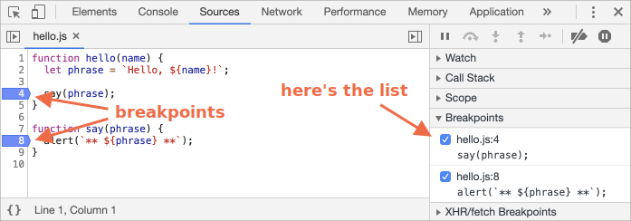
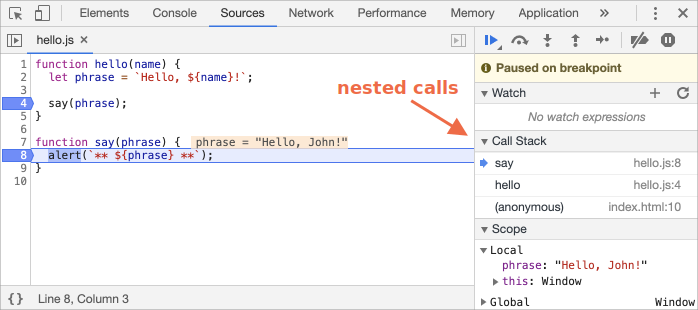

# 在 Chrome 中除錯

在我們寫更複雜的程式碼之前，來說說怎麼除錯吧。

[除錯（Debugging）](https://en.wikipedia.org/wiki/Debugging) 是在腳本中找出並修正錯誤的過程。所有現代瀏覽器和大部分的環境都支援除錯工具 -- 開發工具中特別的使用者介面，用來讓除錯更為簡單。它也可以一步步追蹤程式碼執行步驟，以看出現在到底發生什麼事。

<<<<<<< HEAD
<<<<<<< HEAD
在此我們會使用 Chrome，因為它具有足夠的功能，大部分其它的瀏覽器也有相似的除錯流程。
=======
We'll be using Chrome here, because it has enough features, most other browsers have a similar process.
>>>>>>> 71120d5968cec3103743014cf563e0f7c8045a16
=======
We'll be using Chrome here, because it has enough features, most other browsers have a similar process.
>>>>>>> e01998baf8f85d9d6cef9f1add6c81b901f16d69

## "Sources" 面板

你的 Chrome 版本可能會有些許不同，但它應該還是可以很明顯被看到的。

- 在 Chrome 中打開 [範例頁面](debugging/index.html)。
- 利用 `key:F12`（Mac: `key:Cmd+Opt+I`）開啟開發者工具。
- 選取 `Sources` 面板。

若你是第一次這麼做，你應該會看到這些東西：


<<<<<<< HEAD
切換按鈕 <span class="devtools" style="background-position:-168px -76px"></span> 會打開檔案分頁。
=======
The toggler button <span class="devtools" style="background-position:-172px -98px"></span> opens the tab with files.
>>>>>>> en_upstream

點擊它並在樹狀圖中選擇 `hello.js`，這是應該要顯示的畫面：


<<<<<<< HEAD
<<<<<<< HEAD
在這我們可以看到三個區域：

1. **資源區域** 列出 HTML、JavaScript、CSS 和其他檔案，包含置於頁面中的圖片。Chrome 擴充套件（extensions）也可能顯示在這。
2. **來源區域** 顯示原始碼。
3. **資訊與控制區域** 是為了除錯使用，我們很快會探討它。
=======
The Sources panel has 3 parts:
=======
The Sources panel has 3 parts:

1. The **File Navigator** pane lists HTML, JavaScript, CSS and other files, including images that are attached to the page. Chrome extensions may appear here too.
2. The **Code Editor** pane shows the source code.
3. The **JavaScript Debugging** pane is for debugging, we'll explore it soon.
>>>>>>> e01998baf8f85d9d6cef9f1add6c81b901f16d69

1. The **File Navigator** pane lists HTML, JavaScript, CSS and other files, including images that are attached to the page. Chrome extensions may appear here too.
2. The **Code Editor** pane shows the source code.
3. The **JavaScript Debugging** pane is for debugging, we'll explore it soon.
>>>>>>> 71120d5968cec3103743014cf563e0f7c8045a16

<<<<<<< HEAD
現在你可以再點擊同一個切換鈕 <span class="devtools" style="background-position:-200px -76px"></span> 來隱藏資源列表來給程式碼多一點空間。
=======
Now you could click the same toggler <span class="devtools" style="background-position:-172px -122px"></span> again to hide the resources list and give the code some space.
>>>>>>> en_upstream

## 主控台（Console）

當我們按下 `key:Esc`，則主控台將會在下方開啟。我們可以在此輸入些命令並按下 `key:Enter` 來執行。

在述語被執行後，其結果會在下方顯示。

例如，這邊的 `1+2` 結果為 `3`，且 `hello("debugger")` 沒回傳東西，所以結果是 `undefined`：


## 中斷點（Breakpoints）

來檢查看看 [範例頁面](debugging/index.html) 的程式碼發生什麼事。在 `hello.js` 上點擊行號 `4`，沒錯，就是在 `4` 這個數字上點下去，不是點程式碼。

恭喜！你已經設定一個中斷點了。現在也請點擊第 `8` 行的行號。

應該看起來像這樣（藍色是你應該要點的地方）：



*中斷點* 是除錯器會自動暫停 JavaScript 執行的某個程式碼位置。

當程式碼被暫停，我們可以檢驗目前的變數並在主控台執行一些命令等等。換句話說，我們可以用它來除錯。

我們隨時可以在右側面板中找到所有中斷點的列表，當我們在不同檔案間有很多中斷點時會很有用。這允許我們可以：
- 快速跳至程式碼中的某個中斷點（經由在右側面板點擊它）。
- 經由再次點擊來讓某個中斷點暫時失效。
- 右鍵點擊並選擇 Remove 可以移除某個中斷點。
- ...等等。

```smart header="條件式中斷點"
*右鍵點擊* 某行號允許你建立一個 *條件式* 中斷點，它只有在給予的條件為真值時才會被觸發。

當我們只有在某個特定變數值或特別的函式參數需要中斷時，這會很方便。
```

## 除錯命令

我們也可以經由使用 `debugger` 命令來暫停程式碼，像這樣：

```js
function hello(name) {
  let phrase = `Hello, ${name}!`;

*!*
  debugger;  // <-- 除錯器會停在這裡
*/!*

  say(phrase);
}
```

當我們正在程式碼編輯器中，而不想切換到瀏覽器再到除錯器內查看腳本並設置中斷點時，這會非常方便。

## 暫停且查看

在我們的例子中，`hello()` 在頁面載入時被呼叫，所以（在我們設置中斷點後）啟動除錯器最簡單的方法就是重新載入頁面。所以來按下 `key:F5`（Windows, Linux）或 `key:Cmd+R`（Mac）吧。

因為中斷點已經設定了，執行會暫停在第 4 行：


請打開右側（箭頭標示）的資訊下拉選單，可以讓你檢查目前的程式碼狀態：

1. **`Watch` -- 顯示目前任何表達式的值。**

    你可以點擊加號 `+` 並輸入表達式，除錯器會隨時顯示它的值，並在程序執行時自動重新計算。

2. **`Call Stack` -- 顯示巢狀呼叫鏈。**

    此時除錯器正處於 `hello()` 的呼叫之中，被位於 `index.html` 的腳本所呼叫（此處沒有函式，所以顯示為 `anonymous`）。

    若你點擊一個堆疊項目（如："anonymous"），除錯器會跳到其對應的程式碼，且所有它的變數也可以被檢查。

3. **`Scope` -- 目前的變數。**

    `Local` 顯示區域函式變數，你也可以在原始碼中看到它們的值被強調出來。

    `Global` 顯示全域變數（在函式之外）。

    還有個 `this` 關鍵字我們尚未學習到，但我們很快就會探討它了。

## 追蹤執行

現在是時候來 *追蹤* 腳本了。

<<<<<<< HEAD
右側面板頂部有些按鈕可以使用，來用用看吧。

<span class="devtools" style="background-position:-7px -76px"></span> -- 繼續執行，快捷鍵 `key:F8`。
: 恢復執行。若沒有額外的中斷點，則執行將會繼續且除錯器不會再獲取控制。
=======
There are buttons for it at the top of the right panel. Let's engage them.
<!-- https://github.com/ChromeDevTools/devtools-frontend/blob/master/front_end/Images/src/largeIcons.svg -->
<span class="devtools" style="background-position:-146px -168px"></span> -- "Resume": continue the execution, hotkey `key:F8`.
: Resumes the execution. If there are no additional breakpoints, then the execution just continues and the debugger loses control.
>>>>>>> en_upstream

    這是我們點下去後會看到的：

    

    執行已經被恢復了，直到 `say()` 內的另一個中斷點才暫停。看一下右側 "Call Stack" 的內容，它多增加了一層呼叫，我們現在正在 `say()` 之中。

<<<<<<< HEAD
<span class="devtools" style="background-position:-137px -76px"></span> -- 下一步（執行下一行命令），但 *不會進入函式*，快捷鍵 `key:F10`。
: 若我們點擊它，`alert` 將會顯示出來。要注意這裡的 `alert` 可以是任意函式，執行將會 "跨過（steps over）它"，忽略函式的內部。

<span class="devtools" style="background-position:-72px -76px"></span> -- 下一步，快捷鍵 `key:F11`。
: 和前一個相同，但差在會 "跨進（steps into）" 巢狀函式。點擊它將會一步步進行所有腳本的動作。

<span class="devtools" style="background-position:-104px -76px"></span> -- 繼續執行至目前函式完成為止，快捷鍵 `key:Shift+F11`。
: 執行會被暫停在目前函式的最後一行，當我們因使用 <span class="devtools" style="background-position:-72px -76px"></span> 而意外進入不感興趣的巢狀呼叫時會很有用，此時我們只想盡快結束它並接著繼續。

<span class="devtools" style="background-position:-7px -28px"></span> -- 啟用/關閉 所有中斷點。
: 此按鈕不影響執行，只會讓中斷點全開/關。

<span class="devtools" style="background-position:-264px -4px"></span> -- 啟用/關閉 遇到錯誤時的自動暫停功能。
: 當啟用且開發者工具開著時，腳本錯誤將會自動暫停執行，然後我們可以分析變數來看什麼東西壞了。所以若腳本因為錯誤而掛點，我們可以打開除錯器，啟用這個選項並重新載入頁面來看看它掛在哪和當下的週遭環境是什麼。
=======
<span class="devtools" style="background-position:-200px -190px"></span> -- "Step": run the next command, hotkey `key:F9`.
: Run the next statement. If we click it now, `alert` will be shown.

    Clicking this again and again will step through all script statements one by one.

<span class="devtools" style="background-position:-62px -192px"></span> -- "Step over": run the next command, but *don't go into a function*, hotkey `key:F10`.
: Similar to the previous "Step" command, but behaves differently if the next statement is a function call. That is: not a built-in, like `alert`, but a function of our own.

    The "Step" command goes into it and pauses the execution at its first line, while "Step over" executes the nested function call invisibly, skipping the function internals.

    The execution is then paused immediately after that function.

    That's good if we're not interested to see what happens inside the function call.

<span class="devtools" style="background-position:-4px -194px"></span> -- "Step into", hotkey `key:F11`.
: That's similar to "Step", but behaves differently in case of asynchronous function calls. If you're only starting to learn JavaScript, then you can ignore the difference, as we don't have asynchronous calls yet.

    For the future, just note that "Step" command ignores async actions, such as `setTimeout` (scheduled function call), that execute later. The "Step into" goes into their code, waiting for them if necessary. See [DevTools manual](https://developers.google.com/web/updates/2018/01/devtools#async) for more details.

<span class="devtools" style="background-position:-32px -194px"></span> -- "Step out": continue the execution till the end of the current function, hotkey `key:Shift+F11`.
: Continue the execution and stop it at the very last line of the current function. That's handy when we accidentally entered a nested call using <span class="devtools" style="background-position:-200px -190px"></span>, but it does not interest us, and we want to continue to its end as soon as possible.

<span class="devtools" style="background-position:-61px -74px"></span> -- enable/disable all breakpoints.
: That button does not move the execution. Just a mass on/off for breakpoints.

<span class="devtools" style="background-position:-90px -146px"></span> -- enable/disable automatic pause in case of an error.
: When enabled, and the developer tools is open, a script error automatically pauses the execution. Then we can analyze variables to see what went wrong. So if our script dies with an error, we can open debugger, enable this option and reload the page to see where it dies and what's the context at that moment.
>>>>>>> en_upstream

```smart header="繼續至此（Continue to here）"
右鍵點擊一行程式碼可以開啟有著一個非常棒選項的選單，"Continue to here"。

當我們想要向前移動多個步驟直到此行，卻又懶到不想設置中斷點時，這會非常方便。
```

## 紀錄

想要從我們的程式碼輸出某些東西到主控台時，有個 `console.log` 函式可以用。

舉個例，這將會輸出從 `0` 到 `4` 的值到主控台：

```js run
// 打開主控台來看看
for (let i = 0; i < 5; i++) {
  console.log("value,", i);
}
```

一般使用者不會看到這些輸出，它只在主控台內。想要看到的話，只能打開開發者工具的主控台面板，或在位於其他面板時按下 `key:Ese`：這將在底部開啟主控台。

若我們在程式碼內做充足的紀錄，則我們可以從紀錄中看發生什麼事，而不需要用到除錯器。

## 總結

如我們所見，有三種主要暫停腳本的方式：
1. 中斷點。
2. `debugger` 述語。
3. 錯誤（若開發者工具開著且按鈕 <span class="devtools" style="background-position:-264px -4px"></span> 開啟著）。

當暫停時，我們可以除錯 - 檢查變數和追蹤程式碼來看執行哪裡有問題。

開發者工具有更多尚未在此被介紹的選項，完整的操作手冊在 <https://developers.google.com/web/tools/chrome-devtools>。

本章節的資訊已經夠用於除錯了，但之後，尤其當你做了很多瀏覽器相關的事以後，請去看看更多開發者工具的進階功能。

喔，當然你也可以點擊開發者工具的不同位置來看看什麼會顯示出來，這也許是學習使用開發者工具最快的途徑，也不要忘了右鍵點擊查看選單喔！

