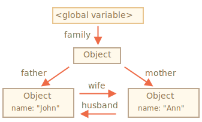
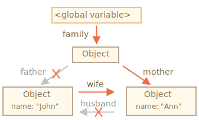
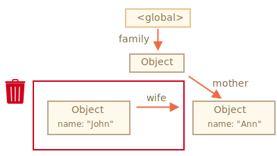
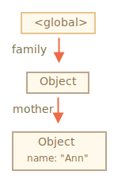
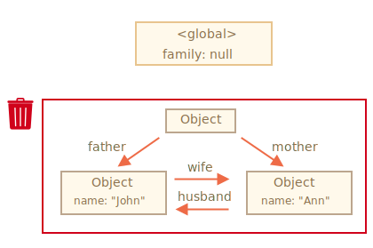
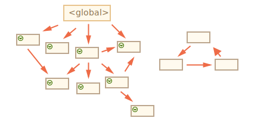
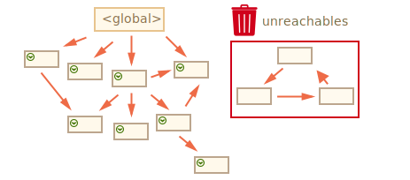

# 垃圾回收（Gargabe collection, GC）

JavaScript 中的記憶體管理是自動運行且我們看不到的。我們建立原生類型、物件、函式... 全部都需要記憶體。

當有些東西不再需要時會發生什麼事呢？JavaScript 引擎要如何發現並清除它呢？

## 可達性（Reachability）

JavaScript 中最重要的記憶體管理原則是 *可達性（reachability）*。

簡單說，"可達的" 值是那些以某種方式可存取使用的東西，它們保證會被存放在記憶體內。

1. 有些基本集合本質上就是可達的值，它們很明顯不能被刪除。

    舉個例：

    - 目前函式的區域變數與參數。
    - 目前巢狀呼叫鏈上的其它函式所擁有的變數與參數。
    - 全域變數。
    - （還有其它些內部的東西）

    這些值被稱為 *根（roots）*。

2. 當某個值可以從根經由參考或是參考鍊抵達，那也會被視為可達。

<<<<<<< HEAD:1-js/04-object-basics/02-garbage-collection/article.md
    舉個例，若區域變數有某個物件且該物件有個屬性參考至另一個物件，則後者的物件就會被視為可達，且它所參考到的所有東西也會被視為可達，底下會有詳細的例子。
=======
    For instance, if there's an object in a global variable, and that object has a property referencing another object, *that* object is considered reachable. And those that it references are also reachable. Detailed examples to follow.
>>>>>>> 23da191b58643387783f38e999f5b05be87d3d93:1-js/04-object-basics/03-garbage-collection/article.md

JavaScript 引擎有個背景程序稱為 [垃圾回收器（garbage collector）](https://en.wikipedia.org/wiki/Garbage_collection_(computer_science))，它監視所有物件並移除那些變成不可達的東西。

## 簡單的例子

這裡有個最簡單的例子：

```js
// user 參考此物件
let user = {
  name: "John"
};
```


在此的箭頭描述著某個物件的參考。全域變數 `"user"` 參考了物件 `{name: "John"}`（為了簡短點，之後就直接叫 John），John 的 `"name"` 屬性存放了一個原生類型，所以被畫在物件內。

若 `user` 的值被覆蓋了，該參考就會消失：

```js
user = null;
```


現在 John 變得不可達，沒辦法存取它，也沒有對於它的參考。垃圾回收器將會把這筆資料視為垃圾並釋放其記憶體。

## 兩個參考

現在想像我們複製了由 `user` 至 `admin` 的參考：

```js
// user 有個對於該物件的參考
let user = {
  name: "John"
};

*!*
let admin = user;
*/!*
```


若現在我們做一樣的事：

```js
user = null;
```

...則物件經由 `admin` 這個全域變數依然是可達的，所以它還是會在記憶體中。若我們也覆蓋了 `admin`，則它就會被移除掉。

## 互相連結的物件

現在有個更為複雜的例子，family：

```js
function marry(man, woman) {
  woman.husband = man;
  man.wife = woman;

  return {
    father: man,
    mother: woman
  }
}

let family = marry({
  name: "John"
}, {
  name: "Ann"
});
```

函式 `marry` 讓兩個物件互相參考來 "結婚"，並回傳一個包含兩者的新物件。

產生的記憶體結構：



至此所有物件都是可達的。

現在來移除兩個參考看看：

```js
delete family.father;
delete family.mother.husband;
```



若只刪掉這兩個參考的其中一個是不夠的，因為所有物件將依然可達。

但若我們兩個都刪掉，則可以看到再也沒有對於 John 的傳入參考（incoming reference）了：



傳出參考（outgoing reference）並不重要，只有傳入參考可以讓物件變得可達。所以 John 現在變得不可達且將會從記憶體中被移除，其所包含的資料也會變成不可達。

在垃圾回收之後：



## 不可達的島嶼

有可能整個互相連結的物件島嶼都變得不可達且被從記憶體中移除。

用跟上面的例子一樣的物件，然後：

```js
family = null;
```

記憶體中的樣子會變成：



這個例子演示了可達性的概念有多重要。

很明顯的 John 和 Ann 依然連結著，兩者皆有傳入參考，但那並不夠。

更前面的 `"family"` 物件不再連結著根，不再有對它的參考，所以整個島嶼都變得不可達且將被移除。

## 內部演算法

基本的垃圾回收演算法稱為 "標記和清理（mark-and-sweep）"。

底下的 "垃圾回收" 步驟會定期被執行：

- 垃圾回收器取得根並 "標記"（記憶）它們。
- 然後拜訪並 "標記" 根的所有參考。
- 然後拜訪被標記的物件並標記 *它們的* 參考。所有被拜訪的物件都會被記住，因此同樣的物件將不會被二次拜訪。
- ...持續如此，直到每個（由根可達的）的參考都被拜訪過為止。
- 除了被標記的物件以外，其餘所有物件將被移除。

舉個例，物件結構若像這樣：


我們可以清楚看到右側有個 "不可達的島嶼"，現在來看看 "標記和清理" 的垃圾回收器如何處理它。

第一步標記根：


然後標記它們的參考：


...若還有參考就再標記：



現在，在過程中無法被拜訪的物件會被視為不可達，且將會被移除：



我們也可以將此過程想像成從根倒出一大桶油漆，流經所有參考並標記所有可達的物件。沒被標記到的就會被移除。

這就是垃圾回收器如何運作的概念。JavaScript 引擎套用許多優化來讓它跑得更快，且不影響執行。

某些優化的地方：

- **分代回收（Generational collection）** -- 物件被分為兩個集合："舊的" 和 "新的"。很多物件快速地出現做完事情就消失，它們可被積極的清理。那些存活夠久並變得 "老舊" 的物件將會減少檢查。
- **遞增回收（Incremental collection）** -- 若存在很多物件，且我們試著一次拜訪並標示完成，那可能會花些時間並在執行上產生看得見的延遲。所以引擎會試圖將垃圾回收拆成多個部分，然後每個部分會一個接一個被分開執行。在它們之間將需要些額外的標記來追蹤變動，但我們就可以只有些許微小而非整個很大的延遲。
- **閒時回收（Idle-time collection）** -- 垃圾回收器試著只在 CPU 閒下來的時候執行，來減少對執行可能的影響。

還有其它垃圾回收演算法的優化與方式。儘管我想描述多點也得先停下來，因為不同引擎實作不同的調整與技巧。並且更重要的是，隨著引擎的開發會隨時變動，所以若沒有實際需要而 "事先" 知道這麼深入其實不太值得。當然，若你有著純粹有興趣想了解，那底下有些為你準備的連結。

## 總結

主要該知道的是：

- 垃圾回收是自動被執行的，我們不能強迫或預防它執行。
- 當物件為可達時會被保留在記憶體中。
- 被參考跟可（由根）抵達是不一樣的：一組互相連結的物件可以整個變成不可達。

現代化引擎實作垃圾回收的進階演算法。

有本通用的書 "The Garbage Collection Handbook: The Art of Automatic Memory Management"（R. Jones et al）介紹了一部分。

若你對低階程式運作感興趣，在這篇文章 [A tour of V8: Garbage Collection](http://jayconrod.com/posts/55/a-tour-of-v8-garbage-collection) 有關於 V8 垃圾回收的更詳細資訊。

[V8 blog](https://v8.dev/) 也不時會發表關於記憶體管理變更的文章。當然，要學習垃圾回收，你最好經由學習關於 V8 的內部知識來準備，並閱讀 [Vyacheslav Egorov](http://mrale.ph) 的部落格，他是負責 V8 的工程師之一。我之所以說 "V8"，是因為它最容易被網路文章所提到。對於其它引擎，許多作法雖然是相似的，但垃圾回收在很多方面會不太一樣。

當你需要底層優化時，有關於引擎的更深入知識是很好的。在你熟悉了此語言之後，將它作為下一步的學習計畫會很明智。

